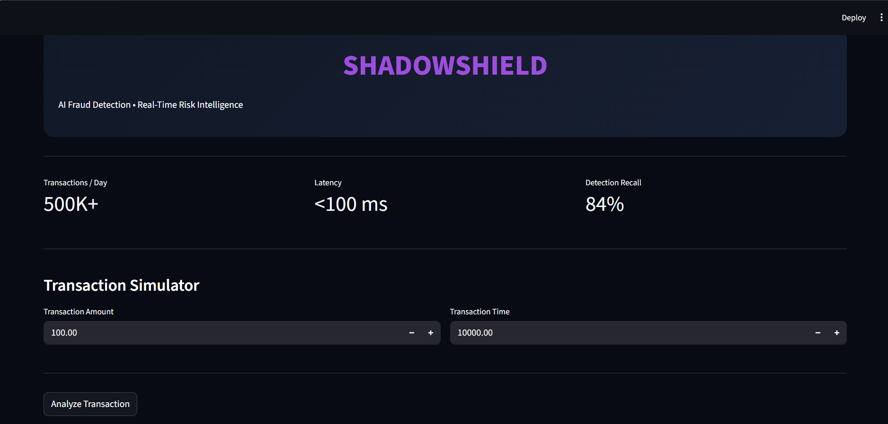
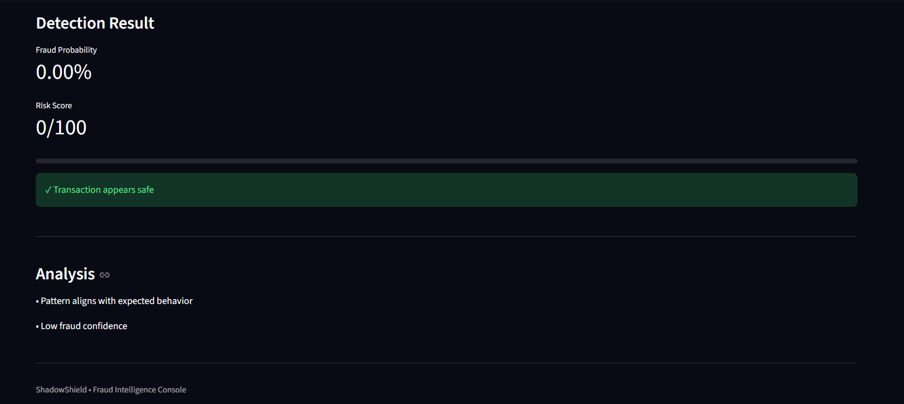
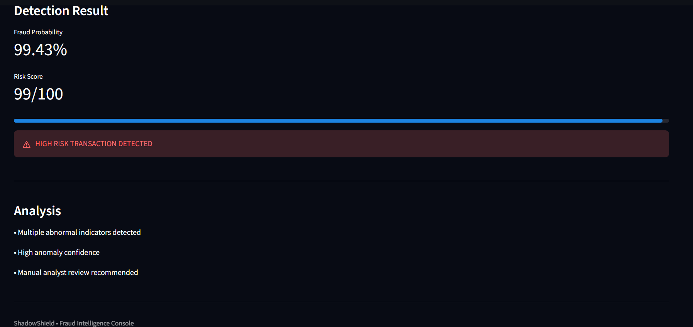

# 🛡️ ShadowShield  
### Real-Time AI Fraud Detection Dashboard

ShadowShield is an industry-inspired fraud detection system designed to simulate real-time transaction risk analysis using machine learning.

Built to demonstrate how modern financial institutions can score suspicious transactions, reduce fraud exposure, and provide explainable decision support.

---

## ✨ Preview

### Dashboard


### Safe Transaction


### Fraud Detection


---

## 🚀 Features

✔ Real-time fraud probability scoring  
✔ Interactive transaction simulator  
✔ Risk classification engine  
✔ Streamlit dashboard UI  
✔ XGBoost-based prediction  
✔ Industry-style analytics experience  
✔ Low-latency transaction evaluation  

---

## 🧠 Problem Statement

Traditional rule-based fraud systems struggle to adapt to evolving transaction behavior.

ShadowShield demonstrates an AI-driven workflow capable of:

- Detecting suspicious transactions
- Assigning fraud probability
- Minimizing false alerts
- Supporting faster analyst decisions

---

## 🏗 Architecture

```text
User Input
   ↓
Streamlit Dashboard
   ↓
Feature Processing
   ↓
XGBoost Fraud Model
   ↓
Risk Probability
   ↓
Result + Analysis
```

---

## 🛠 Tech Stack

| Layer | Technology |
|-------|------------|
| Frontend | Streamlit |
| Backend | Python |
| ML | Scikit-learn |
| Model | XGBoost |
| Data | Pandas |
| Version Control | Git + GitHub |

---

## 📂 Project Structure

```text
project_shadowshield
│
├── backend/
│   ├── check_data.py
│   └── train_model.py
│
├── frontend/
│   └── app.py
│
├── screenshots/
│
├── README.md
└── requirements.txt
```

---

## ⚙ Installation

Clone:

```bash
git clone https://github.com/Janhavibytes/ShadowShield-AI-Fraud-Detection.git
```

Install:

```bash
pip install -r requirements.txt
```

Run:

```bash
streamlit run frontend/app.py
```

---

## 📈 Example Output

| Amount | Time | Output |
|--------|------|--------|
| 50 | 10000 | Safe |
| 20000 | 0 | High Risk |

---

## 🔮 Future Improvements

- Explainable AI (SHAP)
- FastAPI deployment
- Drift monitoring
- Real-time API scoring
- Cloud deployment

---

## 👩‍💻 Author

**Janhavi**

Built as an AI + Fraud Detection portfolio project.